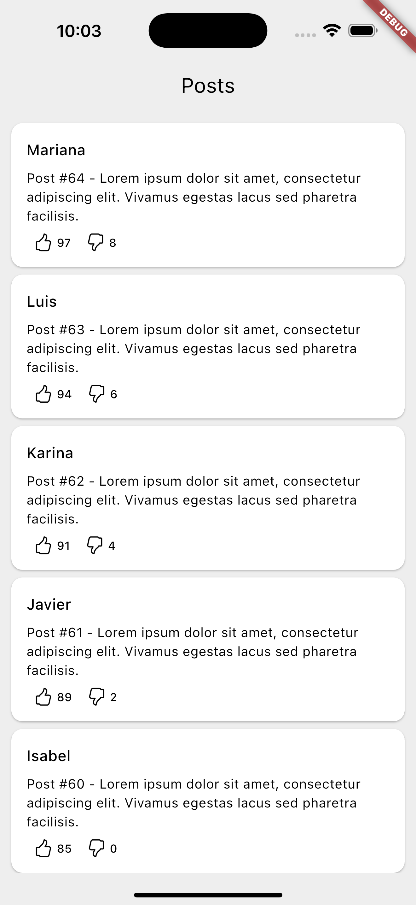
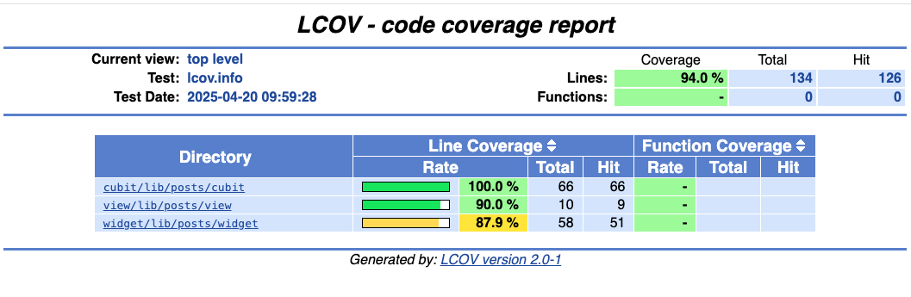

# Firestore Posts

This Flutter application allows users to query a collection of posts from Firestore and displays them in a list with automatic pagination, allowing users to like or dislike each post.

## Screenshots

|                           Android                                 |                         iOS                                   |
|:-----------------------------------------------------------------:|:-------------------------------------------------------------:|
|    |    |


## Features

- Users should be able to see a list of posts
- Users should be able to like or dislike a post.

# Starting 🚀

These instructions will allow you to obtain a copy of the application for testing.

## Getting Started
To build and run this project:

1. Get Flutter [here](https://flutter.dev) if you don't already have it
2. Clone this repository `git clone https://github.com/alvaroarmijos/firestore_posts`
3. `cd` into the repo folder `cd firestore_posts`
4. Sync the project `flutter pub get`
5. run `flutter run` to run the app.


## Running the example code

This sample requires Flutter 3.29.1

## Running Tests

The test coverage of this application is 94%.

<p>
     
</p>

All you have to do is to run these three commands:

```
# Note: on macOS you need to have lcov installed on your system (`brew install lcov`)
# Install very_good_cli
dart pub global activate very_good_cli
# Run all tests
very_good test --coverage --min-coverage 90 --test-randomize-ordering-seed random
# Generate Test Coverage
genhtml coverage/lcov.info -o coverage/html 
# Open the report
open coverage/html/index.html                           
```

## Requirements 📋
You need these packages for the application to work
- Service Locator for DI: [get_it](https://pub.dev/packages/get_it "get_it")
- State management: [flutter_bloc ](https://pub.dev/packages/flutter_bloc "flutter_bloc ")
- Code generation for immutable classes: [freezed](https://pub.dev/packages/freezed "freezed")